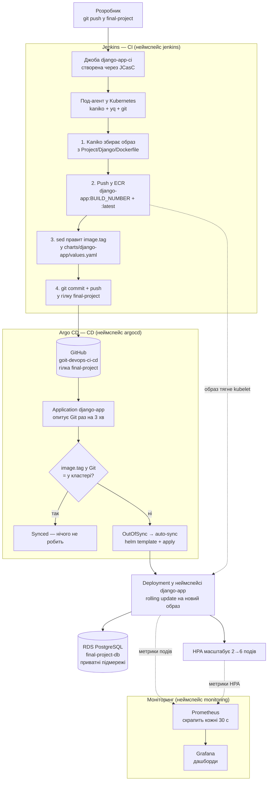

# Фінальний проєкт — повна інфраструктура в AWS через Terraform

Один `terraform apply` піднімає все: мережу, кластер Kubernetes, керовану базу
даних, реєстр образів, замкнений CI/CD-цикл і моніторинг.

| Компонент | Що це в проєкті |
|---|---|
| **VPC** | `10.0.0.0/16`, 3 публічні + 3 приватні підмережі в трьох зонах, IGW, NAT |
| **EKS** | Кластер `final-project-eks`, 2–5 нод `m7i-flex.large`, add-ons, OIDC, EBS CSI |
| **RDS** | PostgreSQL 16 у приватних підмережах — **справжня база застосунку** |
| **ECR** | Реєстр `django-app`, куди пайплайн публікує образи |
| **Jenkins** | CI: Kaniko збирає образ, пушить у ECR, комітить новий тег у Git |
| **Argo CD** | CD: бачить коміт у Git і розгортає нову версію в кластер |
| **Prometheus** | Збирає метрики кластера, нод, подів і об'єктів Kubernetes |
| **Grafana** | Готові дашборди поверх Prometheus |

> **Папка `Project/`, гілка `final-project`.** Назва папки взята зі структури
> в умові завдання. Гілка згадується в коді один раз — у `local.git_branch`
> (`main.tf`), і саме її читають Jenkins та Argo CD.

## Як це працює разом



Ключова деталь: **Jenkins не має доступу до кластера й нічого не деплоїть.**
Він лише публікує образ і змінює один рядок у Git. Усе, що відбувається в
кластері, робить Argo CD, і єдине джерело правди для нього — вміст
репозиторію. Це і є GitOps: щоб дізнатись, що зараз у кластері, достатньо
подивитись у Git.

## Структура

```text
Project/
├── main.tf                     # Провайдери, локальні значення, підключення модулів
├── backend.tf                  # Бекенд для стейту (S3 + DynamoDB)
├── variables.tf                # Секрети + перемикачі БД
├── outputs.tf                  # Загальне виведення ресурсів і готові команди
├── terraform.tfvars.example    # Шаблон для terraform.tfvars
│
├── modules/
│   ├── s3-backend/             # S3-бакет і DynamoDB для стейту
│   │   ├── s3.tf
│   │   ├── dynamodb.tf
│   │   ├── variables.tf
│   │   └── outputs.tf
│   │
│   ├── vpc/                    # VPC, підмережі, IGW, NAT, теги для EKS
│   │   ├── vpc.tf
│   │   ├── routes.tf
│   │   ├── variables.tf
│   │   └── outputs.tf
│   │
│   ├── ecr/                    # Реєстр Docker-образів
│   │   ├── ecr.tf
│   │   ├── variables.tf
│   │   └── outputs.tf
│   │
│   ├── eks/                    # Kubernetes-кластер
│   │   ├── eks.tf              # IAM-ролі, кластер, node group, add-ons
│   │   ├── oidc.tf             # OIDC-провайдер — фундамент IRSA
│   │   ├── aws_ebs_csi_driver.tf  # CSI-драйвер + дефолтний StorageClass
│   │   ├── variables.tf
│   │   ├── providers.tf
│   │   └── outputs.tf
│   │
│   ├── rds/                    # Універсальний модуль БД (Aurora або звичайна RDS)
│   │   ├── shared.tf           # Умовна логіка + subnet group, SG, parameter group
│   │   ├── rds.tf              # aws_db_instance            (use_aurora = false)
│   │   ├── aurora.tf           # aws_rds_cluster + інстанси (use_aurora = true)
│   │   ├── variables.tf
│   │   ├── outputs.tf
│   │   └── README.md           # Повний опис модуля й усіх його змінних
│   │
│   ├── jenkins/                # Helm-установка Jenkins
│   │   ├── jenkins.tf          # Namespace, секрети, IRSA, helm_release
│   │   ├── values.yaml         # Конфігурація чарта + JCasC (плагіни, джоба)
│   │   ├── variables.tf
│   │   ├── providers.tf
│   │   └── outputs.tf
│   │
│   ├── argo_cd/                # Helm-установка Argo CD
│   │   ├── argo_cd.tf          # Namespace, helm_release argo-cd + app-of-apps
│   │   ├── values.yaml
│   │   ├── variables.tf
│   │   ├── providers.tf
│   │   ├── outputs.tf
│   │   └── charts/             # Локальний чарт, що створює об'єкти Argo CD
│   │       ├── Chart.yaml
│   │       ├── values.yaml
│   │       └── templates/
│   │           ├── application.yaml    # Application з auto-sync
│   │           └── repository.yaml     # Секрет доступу до репозиторію
│   │
│   └── monitoring/             # Prometheus + Grafana (kube-prometheus-stack)
│       ├── monitoring.tf       # Namespace + helm_release
│       ├── values.yaml         # Конфігурація стека під EKS
│       ├── variables.tf
│       ├── providers.tf
│       └── outputs.tf
│
├── charts/
│   └── django-app/             # Чарт застосунку — за ним стежить Argo CD
│       ├── templates/
│       │   ├── deployment.yaml # + initContainer з manage.py migrate
│       │   ├── service.yaml
│       │   ├── configmap.yaml
│       │   ├── secret.yaml
│       │   ├── hpa.yaml
│       │   ├── postgres.yaml   # запасна вбудована база (у проєкті вимкнена)
│       │   ├── _helpers.tpl
│       │   └── NOTES.txt
│       ├── Chart.yaml
│       └── values.yaml         # image.tag тут оновлює Jenkins
│
├── Django/
│   ├── app/                    # Код застосунку
│   ├── Dockerfile              # Контекст збірки — уся папка Django/
│   ├── Jenkinsfile             # Пайплайн: Kaniko → ECR → values.yaml → Git
│   └── docker-compose.yaml     # Локальний запуск: застосунок + PostgreSQL
│
└── README.md
```

## Що нового відносно ДЗ8-9 і ДЗ10

**Модуль `monitoring`.** Один Helm-реліз `kube-prometheus-stack` замість
чотирьох окремих: Prometheus Operator, Prometheus, Alertmanager,
node-exporter, kube-state-metrics і Grafana з готовими дашбордами й уже
підключеним datasource. Ставити `prometheus` і `grafana` окремо теж можна, але
тоді datasource, ServiceMonitor'и й дашборди довелось би описувати руками — а
це рівно те, що ця збірка робить сама.

**Застосунок переведено на RDS.** У ДЗ10 модуль бази існував, але Django й далі
працював із вбудованим PostgreSQL із чарта. Тут база — справжня: у відповіді
застосунку `"database": "ok"` означає підключення до `final-project-db`, а не
до пода поруч. Як це зроблено без пароля в Git — розділ
[«Як застосунок дізнається про RDS»](#як-застосунок-дізнається-про-rds).

**Міграції як initContainer.** `manage.py migrate` виконується один раз перед
стартом пода й з того самого образу. Якщо база недоступна, под не стає Ready —
і Service не пошле на нього жодного запиту.

**Третя нода.** У кластері тепер одночасно живуть Jenkins (~1 ГБ), Argo CD
(~1 ГБ), Prometheus з Grafana (~1 ГБ), сам застосунок і транзитні поди-агенти.
На двох нодах сума `requests` підходить упритул до ліміту, і черговий под
мовчки лишається в `Pending`.

**Argo CD віддає HTTPS.** У ДЗ8-9 стояв `server.insecure: true` — зручно за
L4-балансувальником, але команда з умови завдання
(`port-forward svc/argocd-server 8081:443`) з ним дала б обірване з'єднання.
Ціна — попередження браузера про самопідписаний сертифікат.

## Як застосунок дізнається про RDS

Endpoint бази з'являється тільки після `apply`, тож у Git його бути не може.
Пароля в Git не має бути тим паче. Розв'язано так:

```
Terraform                          Argo CD                     Kubernetes
─────────────────────────────      ─────────────────────       ──────────────────
random_password                →   (нікуди)               →    Secret django-app-db
module.rds.endpoint            →   helm.valuesObject      →    ConfigMap застосунку
charts/.../values.yaml (Git)   →   базові values          →    решта налаштувань
```

1. **Пароль** генерує `random_password` і Terraform кладе його в Kubernetes
   Secret `django-app-db` у неймспейсі застосунку. У Git пароля немає, в
   Application Argo CD — теж (там лише *посилання* на Secret).
2. **Координати бази** (`POSTGRES_HOST`, `PORT`, `DB`, `USER`) Argo CD накладає
   поверх `values.yaml` під час рендерингу — через `spec.source.helm.valuesObject`
   в Application, який заповнює Terraform.
3. **Чарт** додає ці джерела в `envFrom` **останніми**. У Kubernetes при збігу
   ключів виграє останнє джерело — саме так пароль з `django-app-db` перекриває
   демонстраційне значення з `values.yaml`.

Файл у Git при цьому лишається джерелом правди для всього іншого — зокрема для
`image.tag`, який після кожної збірки переписує Jenkins. Контракт CI/CD не
зачеплено.

Перевірити, що застосунок справді ходить у RDS:

```bash
curl "http://$(eval "$(terraform output -raw app_url_command)")/" | jq '.database, .config.POSTGRES_HOST'
```

## Передумови

- [Terraform](https://developer.hashicorp.com/terraform/install) `>= 1.5.0`
- [AWS CLI v2](https://docs.aws.amazon.com/cli/latest/userguide/getting-started-install.html) з налаштованими обліковими даними
- [kubectl](https://kubernetes.io/docs/tasks/tools/)
- [Helm](https://helm.sh/docs/intro/install/) `>= 3`
- GitHub Personal Access Token (як його зробити — нижче)

Docker локально **не потрібен**: образ збирає Kaniko всередині кластера.
Він знадобиться лише для `docker compose` у папці `Django/`.

### GitHub Personal Access Token

Jenkins клонує репозиторій і пушить у нього зсередини кластера, де немає ні
вашого `~/.ssh`, ні ssh-агента. Тому доступ — по HTTPS із токеном. На вашу
локальну роботу по SSH це не впливає: обидва способи співіснують.

1. [Створіть fine-grained token](https://github.com/settings/personal-access-tokens/new)
2. **Repository access** → Only select repositories → `goit-devops-ci-cd`
3. **Permissions** → Repository permissions → **Contents: Read and write**
4. Скопіюйте токен — GitHub покаже його лише один раз

## Етап 1. Підготовка середовища

```bash
cd Project
cp terraform.tfvars.example terraform.tfvars
```

Відкрийте `terraform.tfvars` і підставте логін, токен і два паролі (Jenkins,
Grafana). Файл під `.gitignore` — у репозиторій він не потрапить.

Якщо ви форкнули репозиторій під іншим ім'ям, виправте `git_repo_url` у блоці
`locals` файлу `main.tf`. Усе інше — гілка, шляхи до Jenkinsfile, Dockerfile
і чарта — виводиться звідти автоматично й потрапляє і в Jenkins, і в Argo CD.

Ініціалізація й перевірка:

```bash
terraform init
terraform validate
terraform plan      # ≈59 ресурсів до створення
```

`terraform plan` має відпрацювати **без помилок**. Змінні, які варто
переглянути перед apply, — у `terraform.tfvars.example`: тип бази, клас
інстанса, потреба в зовнішніх балансувальниках.

<details>
<summary>Якщо бекенду для стейту ще не існує (розгортання з нуля)</summary>

`backend.tf` посилається на бакет, який створює цей самий код, — на першому
запуску виникає замкнене коло. Розривається у два етапи:

```bash
# 1) увімкніть create_state_backend = true у main.tf
#    і закоментуйте блок backend "s3" у backend.tf
terraform init
terraform apply -target=module.s3_backend

# 2) розкоментуйте блок backend "s3" і перенесіть стейт у S3
terraform init -migrate-state
```

</details>

## Етап 2. Розгортання інфраструктури

```bash
terraform apply
```

Одного `apply` достатньо. Провайдери `kubernetes` і `helm` налаштовуються на
endpoint кластера, якого на порожньому акаунті ще немає, але Terraform
відкладає їх конфігурацію до моменту, коли справа дійде до ресурсів у кластері,
— а на той час EKS уже піднято.

Разом **20–30 хвилин**, з них 15–20 — кластер і node group, ще 5–10 паралельно
— база даних.

Після завершення:

```bash
eval "$(terraform output -raw kubectl_config_command)"

kubectl get nodes
kubectl get pods -A
```

Очікувано: три ноди `Ready`; у `jenkins` — под `jenkins-0` у стані `2/2 Running`;
у `argocd` — п'ять подів; у `monitoring` — Prometheus, Grafana, Alertmanager,
kube-state-metrics і по поду node-exporter на кожну ноду.

```bash
# PVC Jenkins має бути Bound, а не Pending — це перевірка EBS CSI-драйвера
kubectl get pvc -n jenkins
```

### Перевірка стану ресурсів

Три команди з умови завдання. Кожна тримає термінал зайнятим — запускайте
в окремих вкладках або додавайте `&`.

```bash
kubectl port-forward svc/jenkins 8080:8080 -n jenkins
kubectl port-forward svc/argocd-server 8081:443 -n argocd
kubectl port-forward svc/grafana 3000:80 -n monitoring
```

| Сервіс | Адреса | Логін | Пароль |
|---|---|---|---|
| Jenkins | http://localhost:8080 | `admin` | `terraform output -raw jenkins_password_command` → виконати |
| Argo CD | https://localhost:8081 | `admin` | `terraform output -raw argocd_password_command` → виконати |
| Grafana | http://localhost:3000 | `admin` | з `terraform.tfvars`, ключ `grafana_admin_password` |

> Argo CD відкривається саме по **https** і покаже попередження про
> самопідписаний сертифікат — це очікувано.

Ті самі команди друкує Terraform:

```bash
terraform output verification_commands
```

Додатково — Prometheus і Alertmanager:

```bash
kubectl port-forward svc/kube-prometheus-stack-prometheus 9090:9090 -n monitoring
kubectl port-forward svc/kube-prometheus-stack-alertmanager 9093:9093 -n monitoring
```

## Етап 3. Запуск CI/CD-циклу

### Jenkins

Джоба `django-app-ci` створена автоматично через **JCasC** — заводити її руками
не треба. Terraform передав у Jenkins:

- креденшел `github-credentials` з вашим PAT;
- глобальні змінні `ECR_REPOSITORY`, `AWS_DEFAULT_REGION`, `DOCKER_CONTEXT_PATH`,
  `CHART_VALUES_PATH`, `GIT_REPO_URL`, `GIT_TARGET_BRANCH`;
- ServiceAccount `jenkins-agent` з IAM-роллю на push у ECR.

Завдяки цьому в `Jenkinsfile` немає жодного захардкодженого URL, регіону чи
шляху. Перевірити: **Manage Jenkins → System → Global properties**.

Відкрийте джобу **django-app-ci** і натисніть **Build Now**.

> Тригера в джоби навмисно немає. Пайплайн сам комітить у ту саму гілку, яку
> читає, тож будь-який SCM-тригер запускав би його на власному коміті —
> нескінченно.

Перша збірка займає 3–5 хвилин. У логу видно:

| Стадія | Що відбувається |
|---|---|
| `Checkout` | повний клон гілки в под-агент |
| `Build & push to ECR` | Kaniko збирає образ і пушить два теги: `<номер збірки>` і `latest` |
| `Update Helm chart` | `sed` правит `image.tag` у `values.yaml`, `yq` перечитує файл і підтверджує запис |
| `Push to Git` | коміт `ci: update image.tag to N [skip ci]` і push у `final-project` |

```bash
# под-агент під час збірки: 4 контейнери (jnlp + kaniko + yq + git)
kubectl get pods -n jenkins -w

# образ у ECR
eval "$(terraform output -raw ecr_list_images_command)"
```

> Після кожної збірки ваша локальна гілка відстає на один коміт. Перед своїм
> наступним push зробіть `git pull --rebase origin final-project`.

### Argo CD

У вебінтерфейсі — застосунок **django-app**. Він має бути **Synced** і
**Healthy**, а на графі видно всі об'єкти чарта: Deployment, Service, HPA,
ConfigMap і Secret.

```bash
kubectl get applications -n argocd
kubectl get application django-app -n argocd \
  -o jsonpath='{.status.sync.status} / {.status.health.status}{"\n"}'

# який саме образ Argo CD зараз розгорнув
kubectl get deployment django-app -n django-app \
  -o jsonpath='{.spec.template.spec.containers[0].image}{"\n"}'
```

Argo CD опитує Git **раз на 3 хвилини**. Щоб не чекати — кнопка **Refresh**.

| Параметр Application | Значення | Навіщо |
|---|---|---|
| `automated.prune` | `true` | видаляти з кластера те, що зникло з Git |
| `automated.selfHeal` | `true` | відкочувати ручні зміни повз Git |
| `ignoreDifferences` на `/spec/replicas` | | **без цього selfHeal воював би з HPA**: автоскейлер піднімає репліки, Argo CD бачить розбіжність із Git і відкочує назад — і так по колу |
| `finalizers` | `resources-finalizer.argocd.argoproj.io` | видалення Application тягне за собою всі створені ним ресурси, включно з LoadBalancer |
| `helm.valuesObject` | координати RDS | значення, яких у Git немає й бути не може |

### Застосунок

До першої збірки Jenkins поди будуть у **ImagePullBackOff** — це нормально:
у чарті вказаний тег, якого в новому ECR-репозиторії ще немає.

```bash
kubectl get pods -n django-app
kubectl get svc -n django-app          # EXTERNAL-IP з'являється за 1–3 хвилини
kubectl get hpa -n django-app          # у TARGETS реальний %, а не <unknown>

curl "http://$(eval "$(terraform output -raw app_url_command)")/"
```

Відповідь показує ім'я пода, стан бази (`"database": "ok"`) і значення з
ConfigMap, серед яких `POSTGRES_HOST` — endpoint RDS.

## Етап 4. Моніторинг

### Grafana

http://localhost:3000, логін `admin`. Datasource Prometheus уже підключений,
дашборди вже імпортовані. Найцікавіші:

| Дашборд | Що показує |
|---|---|
| **Kubernetes / Compute Resources / Cluster** | загальне навантаження, скільки CPU й пам'яті реально зайнято проти запитаного |
| **Kubernetes / Compute Resources / Namespace (Pods)** | оберіть неймспейс `django-app` — видно кожен под застосунку окремо |
| **Kubernetes / Compute Resources / Node (Pods)** | розподіл подів по трьох нодах |
| **Node Exporter / Nodes** | залізо: CPU, пам'ять, диск, мережа кожної ноди |

Під час навантажувального тесту (нижче) на дашборді неймспейсу видно, як
зростає CPU і як слідом за ним HPA додає поди.

### Prometheus

http://localhost:9090 → **Status → Targets**. Усі таргети мають бути `UP`.

Компоненти control plane (`kubeControllerManager`, `kubeScheduler`, `kubeEtcd`,
`kubeProxy`) у `values.yaml` модуля **вимкнені навмисно**: у EKS панель керування
тримає AWS і її внутрішні метрики недоступні ззовні. Якби вони лишились
увімкненими, у Prometheus назавжди висіли б чотири таргети `DOWN`, а
Alertmanager стабільно рапортував би про «зламаний» кластер.

Корисні запити:

```promql
# скільки подів застосунку зараз Running
kube_pod_status_phase{namespace="django-app", phase="Running"}

# поточна кількість реплік проти бажаної, очима HPA
kube_horizontalpodautoscaler_status_current_replicas{namespace="django-app"}
kube_horizontalpodautoscaler_spec_target_metric{namespace="django-app"}

# CPU подів застосунку
sum(rate(container_cpu_usage_seconds_total{namespace="django-app"}[5m])) by (pod)
```

## Повний цикл — те, що варто показати на захисті

```bash
# 1) міняємо щось у застосунку
vim Django/app/myproject/views.py
git add . && git commit -m "Change response payload" && git push origin final-project

# 2) Build Now у Jenkins → пайплайн збирає образ і комітить новий тег

# 3) дивимось, як тег змінився в Git
git pull --rebase origin final-project
git show --stat HEAD
grep -A2 '^image:' charts/django-app/values.yaml

# 4) Refresh в Argo CD → застосунок стає OutOfSync → Syncing → Synced
kubectl get deployment django-app -n django-app \
  -o jsonpath='{.spec.template.spec.containers[0].image}{"\n"}'

# 5) нова версія відповідає
curl "http://$(eval "$(terraform output -raw app_url_command)")/"
```

### Автоскейлер під навантаженням

```bash
kubectl get hpa django-app -n django-app -w

# в іншому терміналі — 2-3 генератори паралельно
kubectl run load-gen-1 -n django-app --rm -it --image=busybox:1.36 --restart=Never -- \
  /bin/sh -c "while true; do wget -q -O- http://django-app/ >/dev/null; done"
```

Поди мають дорости до 6, а Argo CD при цьому лишитись **Synced** — саме за це
відповідає `ignoreDifferences` на `/spec/replicas`. Паралельно відкрийте в
Grafana дашборд **Namespace (Pods)** для `django-app`: там той самий процес
видно графіком.

### База даних

```bash
terraform output rds_endpoint
terraform output rds_instance_class
terraform output rds_applied_parameters
```

Що параметри реально доїхали до AWS:

```bash
aws rds describe-db-parameters --region us-west-2 \
  --db-parameter-group-name "$(terraform output -raw rds_parameter_group_name)" \
  --source user --output table
```

Підключитись можна лише зсередини VPC — база в приватних підмережах і
`publicly_accessible = false`. Найпростіше — разовим подом:

```bash
kubectl run psql --rm -it --image=postgres:16 --restart=Never -n django-app \
  --env="PGPASSWORD=$(terraform output -raw rds_password)" -- \
  psql "host=$(terraform output -raw rds_endpoint) port=5432 user=django_user dbname=django_db" \
  -c '\dt'
```

У списку таблиць видно `auth_user`, `django_migrations` та решту — їх створив
initContainer із міграціями. Це і є доказ, що застосунок не просто «дістукався»
до бази, а справді в ній працює.

Модуль `rds` універсальний: `use_aurora = true` разом із
`db_engine = "aurora-postgresql"` піднімає Aurora-кластер тим самим викликом.
Повний опис — у [`modules/rds/README.md`](modules/rds/README.md).

## Локальний запуск застосунку

Без AWS взагалі — той самий образ і PostgreSQL поруч:

```bash
cd Django
docker compose up --build -d
curl http://localhost:8000/
docker compose down -v
```

## Типові помилки

**`terraform apply` десятками хвилин висить на `aws_eks_node_group.main:
Still creating...`, і нічого не відбувається.**

Найпідступніша з усіх, бо AWS не повідомляє про помилку **взагалі**:

```bash
aws eks describe-nodegroup --cluster-name final-project-eks \
  --nodegroup-name final-project-eks-ng --region us-west-2 \
  --query 'nodegroup.{status:status,health:health.issues,asg:resources.autoScalingGroups}'
# status: CREATING, health.issues: [], asg: null — і так хоч годину
```

Ознака: **немає жодного EC2-інстансу і навіть Auto Scaling Group**. Якщо
інстанси є, але не приєднуються до кластера — це інша проблема (мережа або
IAM), і вона проявляється як `NodeCreationFailure` у `health.issues`.

Причина — акаунт на Free-плані AWS, а тип інстансу не входить у
free-tier-eligible. Актуальний список:

```bash
aws ec2 describe-instance-types --region us-west-2 \
  --filters Name=free-tier-eligible,Values=true \
  --query 'InstanceTypes[].[InstanceType,VCpuInfo.DefaultVCpus,MemoryInfo.SizeInMiB]' --output text
```

> **`--dry-run` тут не працює.** Він перевіряє права й параметри, але не
> зачіпає обмеження Free-плану й бадьоро відповідає «Request would have
> succeeded» на тип, який насправді не запуститься.

Лікування — підставити дозволений тип у `node_instance_types` (`main.tf`),
знести зависну групу й дати Terraform створити її заново:

```bash
terraform destroy -target=module.eks.aws_eks_node_group.main
terraform apply
```

**`FreeTierRestrictionError: The specified backup retention period exceeds the
maximum available to free tier customers.`**
Той самий клас обмеження, але для RDS. `backup_retention_period` у виклику
модуля `rds` уже виставлений в `1` — якщо ви його підняли, поверніть назад.

**Под Jenkins висить у `Pending`, PVC теж `Pending`.**
Перевірте спершу StorageClass: `kubectl get storageclass`. Якщо в жодного немає
позначки `(default)` — це воно. EKS створює клас `gp2`, але **не робить його
дефолтним**, і PVC без явного `storageClassName` не прив'язується ніколи.
Модуль `eks` тому створює власний клас `gp3` і позначає дефолтним, а модуль
`jenkins` ще й вказує його явно.

**Поди застосунку в `Init:CrashLoopBackOff`.**
Впав initContainer із міграціями — тобто база недоступна:

```bash
kubectl logs -n django-app deploy/django-app -c migrate
```

Найімовірніші причини: security group бази не пускає CIDR VPC, або Secret
`django-app-db` не доїхав у неймспейс. Перевірити:

```bash
kubectl get secret django-app-db -n django-app
kubectl get application django-app -n argocd -o jsonpath='{.spec.source.helm.valuesObject}' | jq
```

**Стадія `Build & push to ECR` падає з `no basic auth credentials`.**
Kaniko не отримав креденшели через IRSA:

```bash
kubectl get sa jenkins-agent -n jenkins -o yaml | grep role-arn
kubectl get pod -n jenkins -l jenkins/label -o jsonpath='{.items[*].spec.serviceAccountName}'
```

`serviceAccountName` у `Jenkinsfile` має збігатися зі змінною
`agent_service_account` модуля `jenkins`.

**Стадія `Push to Git` падає з `403`.**
У PAT немає права **Contents: Read and write**, або токен виданий не на цей
репозиторій. Fine-grained токени мають окремий список репозиторіїв.

**Argo CD `Synced`, але образ у кластері старий.**
Пайплайн оновив не той файл. Звіртесь із `terraform output cicd_contract`:
`chart_values_path` пайплайна і `path` в Application мають вказувати на один
і той самий чарт.

**`kubectl get hpa` показує `<unknown>`.**
Немає метрик або `resources.requests.cpu` у контейнері. Add-on `metrics-server`
вмикається в модулі `eks`, requests стоять у `charts/django-app/values.yaml`.

> `metrics-server` і Prometheus — різні речі й потрібні обидва. HPA бере
> метрики з `metrics.k8s.io`, який постачає саме metrics-server; Prometheus
> для нього не джерело.

**Grafana відкривається, але дашборди порожні.**
Prometheus ще не встиг зібрати перші точки — після установки дайте 2–3
хвилини. Якщо порожньо й далі: **Connections → Data sources → Prometheus →
Save & test**.

## Знищення ресурсів

> ⚠️ **Порядок має значення.** Балансувальники створює Kubernetes, а не
> Terraform. Якщо знести VPC раніше, ніж зникнуть Service типу LoadBalancer,
> ELB лишиться сиротою, триматиме підмережу — і `destroy` впаде з
> `DependencyViolation`.

`terraform destroy` робить це правильно сам: `helm_release` знімаються перед
мережею, а Application із `finalizers` змушує Argo CD прибрати за собою ресурси
застосунку разом з його балансувальником.

```bash
terraform destroy
```

Якщо `destroy` завис на неймспейсі `argocd` — Application не може видалитись,
бо контролер Argo CD уже зупинено:

```bash
kubectl patch application django-app -n argocd \
  --type merge -p '{"metadata":{"finalizers":null}}'
```

Після завершення переконайтесь, що платних ресурсів не лишилось:

```bash
aws elbv2 describe-load-balancers --region us-west-2 --query 'LoadBalancers[].LoadBalancerName'
aws ec2 describe-nat-gateways --region us-west-2 \
  --filter Name=state,Values=available --query 'NatGateways[].NatGatewayId'
aws eks list-clusters --region us-west-2
aws rds describe-db-instances --region us-west-2 --query 'DBInstances[].DBInstanceIdentifier'
aws ec2 describe-volumes --region us-west-2 \
  --filters Name=status,Values=available --query 'Volumes[].VolumeId'
```

Останній рядок — про EBS-томи, що лишились без власника. Prometheus і Grafana в
цьому проєкті навмисно налаштовані **без PVC** (`persistence.enabled: false`,
дані в `emptyDir`): Helm при видаленні релізу не прибирає томи, створені
через `volumeClaimTemplates` StatefulSet, і вони тихо тягнули б гроші вже
після `destroy`. Ціна рішення — історія метрик живе стільки ж, скільки под.

> ⚠️ **S3-бакет зі стейтом і DynamoDB-таблиця.** У цьому проєкті модуль
> `s3-backend` вимкнений (`create_state_backend = false`), тому `destroy` їх не
> чіпає — і це навмисно. Якщо ви його ввімкнули, `terraform destroy` знесе
> бакет разом зі стейтом, який у цей момент у ньому й лежить. Робіть
> `terraform state pull > backup.tfstate` перед destroy, а піднімати
> інфраструктуру потім доведеться знову з двоетапного bootstrap.

### Скільки це коштує, поки працює

| Ресурс | ~$/год |
|---|---|
| EKS control plane | 0.10 |
| 3 × `m7i-flex.large` | 0.288 |
| NAT Gateway + Elastic IP | 0.049 |
| Network Load Balancer (застосунок) | 0.023 |
| RDS `db.t3.micro` + 20 ГБ gp3 | 0.021 |
| EBS-том Jenkins (8 ГБ gp3) | 0.001 |
| **Разом** | **≈ 0.48** |

Приблизно **$11.5 на добу**, якщо забути погасити. Розрахунок для
`expose_ui_via_load_balancer = false` — саме так налаштовано за замовчуванням;
`true` додає ще два балансувальники (+$0.045/год).

Що здорожчує базу:

| Зміна | Стає ~$/год | У скільки разів |
|---|---|---|
| `db_multi_az = true` | 0.037 | ×1.8 |
| `use_aurora = true` (1 × `db.t4g.medium`) | 0.082 | ×4 |
| `use_aurora = true` + `db_multi_az = true` | 0.155 | ×7.4 |
