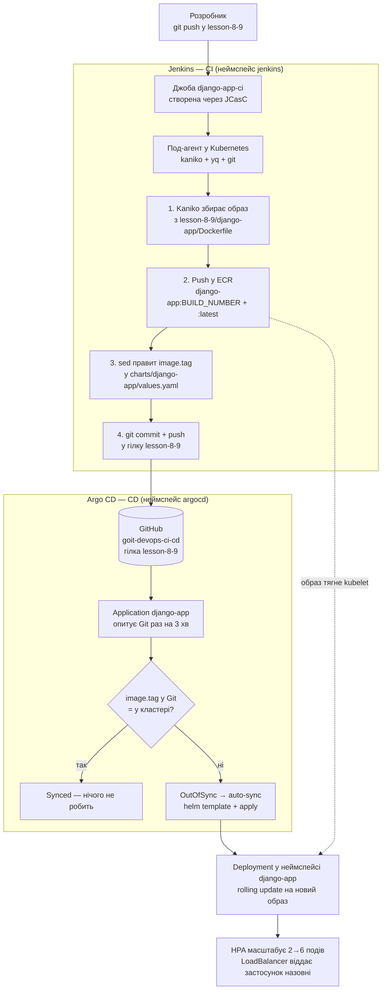

# Lesson 8-9 — Jenkins + Argo CD: повний CI/CD у Kubernetes

Замкнений CI/CD-цикл для Django-застосунку: **Jenkins** збирає образ через
**Kaniko** й публікує його в **ECR**, потім сам комітить новий тег у Helm-чарт,
а **Argo CD** бачить цей коміт у Git і розгортає нову версію в **EKS**.
Обидва інструменти встановлює **Terraform** через **Helm** — жодного
`helm install` руками.

Робота продовжує ДЗ7: модулі `s3-backend`, `vpc`, `ecr`, `eks`, Helm-чарт
`django-app` і сам застосунок перенесені звідти. Папка самодостатня — усе,
що потрібно для розгортання, лежить у ній.

## Схема CI/CD



Ключова деталь: Jenkins **не має доступу до кластера** й нічого не деплоїть.
Він лише публікує образ і змінює один рядок у Git. Все, що відбувається в
кластері, робить Argo CD, і єдине джерело правди для нього — вміст репозиторію.
Це і є GitOps: щоб дізнатись, що зараз у кластері, достатньо подивитись у Git.

## Структура проєкту

```text
lesson-8-9/
├── main.tf                     # Провайдери, локальні значення, підключення модулів
├── backend.tf                  # Бекенд для стейту (S3 + DynamoDB)
├── variables.tf                # Секрети: GitHub PAT, пароль Jenkins
├── outputs.tf                  # Загальне виведення ресурсів і готові команди
├── terraform.tfvars.example    # Шаблон для terraform.tfvars
│
├── Jenkinsfile                 # Пайплайн: Kaniko → ECR → values.yaml → Git
│
├── modules/
│   ├── s3-backend/             # S3-бакет і DynamoDB для стейту
│   ├── vpc/                    # VPC, підмережі, IGW, NAT, теги для EKS
│   ├── ecr/                    # Реєстр Docker-образів
│   │
│   ├── eks/                    # Kubernetes-кластер
│   │   ├── eks.tf              # IAM-ролі, кластер, node group, add-ons
│   │   ├── oidc.tf             # OIDC-провайдер — фундамент IRSA
│   │   ├── aws_ebs_csi_driver.tf # CSI-драйвер для PVC Jenkins
│   │   ├── variables.tf
│   │   ├── providers.tf
│   │   └── outputs.tf
│   │
│   ├── jenkins/                # Helm-установка Jenkins
│   │   ├── jenkins.tf          # Namespace, секрети, IRSA, helm_release
│   │   ├── values.yaml         # Конфігурація чарта + JCasC (плагіни, джоба)
│   │   ├── variables.tf
│   │   ├── providers.tf
│   │   └── outputs.tf
│   │
│   └── argo_cd/                # Helm-установка Argo CD
│       ├── argo_cd.tf          # Namespace, helm_release argo-cd + app-of-apps
│       ├── values.yaml         # Конфігурація Argo CD
│       ├── variables.tf
│       ├── providers.tf
│       ├── outputs.tf
│       └── charts/             # Локальний чарт, що створює об'єкти Argo CD
│           ├── Chart.yaml
│           ├── values.yaml
│           └── templates/
│               ├── application.yaml   # Application з auto-sync
│               └── repository.yaml    # Секрет доступу до репозиторію
│
├── charts/
│   └── django-app/             # Чарт застосунку — за ним стежить Argo CD
│       ├── templates/
│       │   ├── deployment.yaml
│       │   ├── service.yaml
│       │   ├── configmap.yaml
│       │   ├── secret.yaml
│       │   ├── hpa.yaml
│       │   ├── postgres.yaml
│       │   ├── _helpers.tpl
│       │   └── NOTES.txt
│       ├── Chart.yaml
│       └── values.yaml         # image.tag тут оновлює Jenkins
│
├── django-app/                 # Застосунок і Dockerfile — джерело образу
└── README.md
```

## Що створює Terraform

| Модуль | Ресурси |
|---|---|
| `s3-backend` | S3-бакет + DynamoDB-таблиця для стейту. **Вимкнений**: бекенд створено ще в ДЗ5 і він живий |
| `vpc` | VPC `10.0.0.0/16`, 3 публічні + 3 приватні підмережі, IGW, NAT, теги для EKS |
| `ecr` | Репозиторій `django-app` зі скануванням при push і lifecycle-політикою на 10 образів |
| `eks` | Кластер `lesson-8-9-eks`, node group `m7i-flex.large` (2–4 ноди), add-ons, OIDC-провайдер, EBS CSI-драйвер |
| `jenkins` | Неймспейс, два секрети, IAM-роль агента (IRSA), Helm-реліз Jenkins із JCasC і готовою джобою |
| `argo_cd` | Неймспейс, Helm-реліз Argo CD, Application `django-app` з auto-sync і секрет доступу до репозиторію |

### Що змінилось відносно ДЗ7

**Ноди `m7i-flex.large` замість `t3.small`.** У кластері тепер живуть Jenkins
(~1 ГБ) і компоненти Argo CD (~1 ГБ разом) на додачу до застосунку та бази.
На 2 ГБ ноди для них просто не лишилось би місця.

Тип обраний не довільно: на акаунті з Free-планом AWS дозволені **лише
free-tier-eligible типи інстансів**, і `t3.medium` серед них немає. Перевірити
актуальний список для свого акаунта:

```bash
aws ec2 describe-instance-types --region us-west-2 \
  --filters Name=free-tier-eligible,Values=true \
  --query 'InstanceTypes[].[InstanceType,VCpuInfo.DefaultVCpus,MemoryInfo.SizeInMiB]' --output text
```

`m7i-flex.large` — 2 vCPU, 8 ГБ, до 29 подів на ноду. Дешевша альтернатива
з тим самим лімітом подів — `c7i-flex.large` (4 ГБ).

**OIDC-провайдер кластера (`modules/eks/oidc.tf`).** EKS видає подам JWT-токени,
але AWS їм не довіряє, доки issuer кластера не зареєстровано в IAM. Саме ця
реєстрація вмикає IRSA — механізм, за яким IAM-роль довіряє конкретному
ServiceAccount конкретного кластера.

**EBS CSI-драйвер (`modules/eks/aws_ebs_csi_driver.tf`).** Jenkins просить PVC
під `JENKINS_HOME`. У EKS немає вбудованого провізіонера томів, тому без
драйвера PVC назавжди лишається в `Pending`, а разом з ним і под Jenkins.

**IRSA для агента Jenkins (`modules/jenkins/jenkins.tf`).** Kaniko пушить у ECR
без жодного AWS-ключа: IAM-роль довіряє ServiceAccount `jenkins-agent` у
неймспейсі `jenkins`, а вебхук EKS підкидає подам тимчасові креденшели.
Права звужені до одного ECR-репозиторію.

## Передумови

- [Terraform](https://developer.hashicorp.com/terraform/install) `>= 1.5.0`
- [AWS CLI v2](https://docs.aws.amazon.com/cli/latest/userguide/getting-started-install.html) з налаштованими обліковими даними
- [kubectl](https://kubernetes.io/docs/tasks/tools/)
- [Helm](https://helm.sh/docs/intro/install/) `>= 3`
- GitHub Personal Access Token (як його зробити — нижче)

Docker локально **не потрібен**: образ збирає Kaniko всередині кластера.

### GitHub Personal Access Token

Jenkins клонує репозиторій і пушить у нього зсередини кластера, де немає ні
вашого `~/.ssh`, ні ssh-агента. Тому доступ — по HTTPS із токеном. На вашу
локальну роботу по SSH це ніяк не впливає: обидва способи спокійно
співіснують в одному репозиторії.

1. [Створіть fine-grained token](https://github.com/settings/personal-access-tokens/new)
2. **Repository access** → Only select repositories → `goit-devops-ci-cd`
3. **Permissions** → Repository permissions → **Contents: Read and write**
4. Скопіюйте токен — GitHub покаже його лише один раз

## Крок 1. Підготовка

```bash
cd lesson-8-9
cp terraform.tfvars.example terraform.tfvars
```

Відкрийте `terraform.tfvars` і підставте свій логін, токен і пароль для
Jenkins. Файл під `.gitignore` — у репозиторій він не потрапить.

Якщо ви форкнули репозиторій під іншим ім'ям, виправте `git_repo_url`
у блоці `locals` файлу `main.tf`. Усе інше (гілка, шляхи до Jenkinsfile,
Dockerfile і чарта) виводиться звідти автоматично і потрапляє і в Jenkins,
і в Argo CD — див. `terraform output cicd_contract`.

## Крок 2. Terraform

```bash
terraform init
terraform plan     # 47 ресурсів до створення
terraform apply
```

Одного `apply` достатньо. Провайдери `kubernetes` і `helm` налаштовуються на
endpoint кластера, якого на порожньому акаунті ще немає, але Terraform
відкладає їх конфігурацію до моменту, коли справа дійде до ресурсів у
кластері, — а на той час EKS уже піднято. Разом це 20–25 хвилин, з яких
15–20 — створення кластера й node group.

<details>
<summary>Якщо apply усе ж спіткнувся на конфігурації провайдера</summary>

На старіших версіях Terraform (до 1.9) невідомий endpoint у конфігурації
провайдера міг зупинити план. Тоді розбийте apply на два кроки:

```bash
terraform apply -target=module.vpc -target=module.ecr -target=module.eks
terraform apply
```

Попередження про `-target` очікуване; другий `apply` без `-target` приводить
стейт до повного вигляду.

</details>

<details>
<summary>Якщо бекенду для стейту ще не існує (розгортання з нуля)</summary>

`backend.tf` посилається на бакет, який створює цей самий код, — на першому
запуску виникає замкнене коло. Розривається воно у два етапи:

```bash
# 1) увімкніть create_state_backend = true у main.tf
#    і закоментуйте блок backend "s3" у backend.tf
terraform init
terraform apply -target=module.s3_backend

# 2) розкоментуйте блок backend "s3" і перенесіть стейт у S3
terraform init -migrate-state
```

</details>

Після завершення:

```bash
terraform output
```

## Крок 3. Доступ через kubectl

```bash
eval "$(terraform output -raw kubectl_config_command)"

kubectl get nodes
kubectl get pods -A
```

Очікувано: дві ноди `Ready`; у `jenkins` — под `jenkins-0` у стані `2/2 Running`;
у `argocd` — п'ять подів; у `kube-system` серед іншого `metrics-server`
і `ebs-csi-controller`.

```bash
# PVC Jenkins має бути Bound, а не Pending — це перевірка EBS CSI-драйвера
kubectl get pvc -n jenkins
```

## Крок 4. Jenkins

### Вхід

```bash
# зовнішній URL (з'являється за 1–3 хвилини після apply)
echo "http://$(eval "$(terraform output -raw jenkins_url_command)"):8080"

# логін і пароль
terraform output -raw jenkins_admin_username && echo
eval "$(terraform output -raw jenkins_password_command)" && echo
```

Без зовнішнього балансувальника (`expose_ui_via_load_balancer = false`):

```bash
eval "$(terraform output -raw jenkins_port_forward_command)"
# далі http://localhost:8080
```

### Що вже налаштовано

Джоба `django-app-ci` створена автоматично через **JCasC** — її не треба
заводити руками. Terraform передав у Jenkins:

- креденшел `github-credentials` з вашим PAT;
- глобальні змінні `ECR_REPOSITORY`, `AWS_DEFAULT_REGION`, `DOCKER_CONTEXT_PATH`,
  `CHART_VALUES_PATH`, `GIT_REPO_URL`, `GIT_TARGET_BRANCH`;
- ServiceAccount `jenkins-agent` з IAM-роллю на push у ECR.

Завдяки цьому в `Jenkinsfile` немає жодного захардкодженого URL, регіону
чи шляху. Перевірити: **Manage Jenkins → System → Global properties**.

### Запуск

Відкрийте джобу **django-app-ci** і натисніть **Build Now**.

> Тригера в джоби навмисно немає. Пайплайн сам комітить у ту саму гілку,
> яку читає, тож будь-який SCM-тригер запускав би його на власному коміті —
> нескінченно.

Перша збірка займає 3–5 хвилин (тягнуться образи агента). У логу видно:

| Стадія | Що відбувається |
|---|---|
| `Checkout` | повний клон гілки в под-агент |
| `Build & push to ECR` | Kaniko збирає образ і пушить два теги: `<номер збірки>` і `latest` |
| `Update Helm chart` | `sed` правит `image.tag` у `values.yaml`, `yq` перечитує файл і підтверджує запис |
| `Push to Git` | коміт `ci: update image.tag to N [skip ci]` і push у `lesson-8-9` |

### Перевірка результату

```bash
# под-агент під час збірки: 4 контейнери (jnlp + kaniko + yq + git)
kubectl get pods -n jenkins -w

# образ у ECR
eval "$(terraform output -raw ecr_list_images_command)"

# коміт у GitHub
git fetch origin lesson-8-9
git log origin/lesson-8-9 --oneline -3
```

> Після кожної збірки ваша локальна гілка відстає на один коміт.
> Перед своїм наступним push зробіть `git pull --rebase origin lesson-8-9`.

## Крок 5. Argo CD

### Вхід

```bash
echo "http://$(eval "$(terraform output -raw argocd_url_command)")"

# логін admin, пароль Argo CD генерує сам при першій установці
eval "$(terraform output -raw argocd_password_command)" && echo
```

Або без балансувальника:

```bash
eval "$(terraform output -raw argocd_port_forward_command)"
# далі http://localhost:8081
```

### Що дивитись

У вебінтерфейсі — застосунок **django-app**. Він має бути **Synced** і
**Healthy**, а на графі видно всі об'єкти чарта: Deployment, Service, HPA,
ConfigMap, Secret і демо-Postgres.

```bash
kubectl get applications -n argocd
kubectl get application django-app -n argocd \
  -o jsonpath='{.status.sync.status} / {.status.health.status}{"\n"}'

# який саме образ Argo CD зараз розгорнув
kubectl get deployment django-app -n django-app \
  -o jsonpath='{.spec.template.spec.containers[0].image}{"\n"}'
```

Argo CD опитує Git **раз на 3 хвилини**. Щоб не чекати — кнопка **Refresh**
у вебінтерфейсі.

### Як налаштовано Application

| Параметр | Значення | Навіщо |
|---|---|---|
| `automated.prune` | `true` | видаляти з кластера те, що зникло з Git |
| `automated.selfHeal` | `true` | відкочувати ручні зміни повз Git |
| `CreateNamespace=true` | | неймспейс `django-app` створює сам Argo CD |
| `ignoreDifferences` на `/spec/replicas` | | **без цього selfHeal воював би з HPA**: автоскейлер піднімає репліки, Argo CD бачить розбіжність із Git і відкочує назад — і так по колу |
| `finalizers` | `resources-finalizer.argocd.argoproj.io` | видалення Application тягне за собою всі створені ним ресурси, включно з LoadBalancer |

## Крок 6. Застосунок

До першої збірки Jenkins поди застосунку будуть у **ImagePullBackOff** —
це нормально: у чарті стоїть `tag: "latest"`, а в новому ECR-репозиторії ще
немає жодного образу. Після першої збірки все стане на місце.

```bash
kubectl get pods -n django-app
kubectl get svc -n django-app          # EXTERNAL-IP з'являється за 1–3 хвилини
kubectl get hpa -n django-app          # у TARGETS реальний %, а не <unknown>

curl "http://$(eval "$(terraform output -raw app_url_command)")/"
```

Відповідь показує ім'я пода, стан бази й значення з ConfigMap.

## Повний цикл — те, що варто показати на захисті

```bash
# 1) міняємо щось у застосунку
vim django-app/myproject/views.py
git add . && git commit -m "Change greeting" && git push origin lesson-8-9

# 2) Build Now у Jenkins → пайплайн збирає образ і комітить новий тег

# 3) дивимось, як тег змінився в Git
git pull --rebase origin lesson-8-9
git show --stat HEAD
grep -A2 '^image:' charts/django-app/values.yaml

# 4) Refresh в Argo CD → застосунок стає OutOfSync → Syncing → Synced
kubectl get deployment django-app -n django-app \
  -o jsonpath='{.spec.template.spec.containers[0].image}{"\n"}'

# 5) нова версія відповідає
curl "http://$(eval "$(terraform output -raw app_url_command)")/"
```

### Автоскейлер під навантаженням

```bash
kubectl get hpa django-app -n django-app -w

# в іншому терміналі — 2-3 генератори паралельно
kubectl run load-gen-1 -n django-app --rm -it --image=busybox:1.36 --restart=Never -- \
  /bin/sh -c "while true; do wget -q -O- http://django-app/ >/dev/null; done"
```

Поди мають дорости до 6, а Argo CD при цьому лишитись **Synced** — саме за це
відповідає `ignoreDifferences` на `/spec/replicas`.

## Типові помилки

**`terraform apply` десятками хвилин висить на `aws_eks_node_group.main:
Still creating...`, і нічого не відбувається.**

Найпідступніша з усіх, бо AWS не повідомляє про помилку **взагалі**:

```bash
aws eks describe-nodegroup --cluster-name lesson-8-9-eks \
  --nodegroup-name lesson-8-9-eks-ng --region us-west-2 \
  --query 'nodegroup.{status:status,health:health.issues,asg:resources.autoScalingGroups}'
# status: CREATING, health.issues: [], asg: null — і так хоч годину
```

Ознака: **немає жодного EC2-інстансу і навіть Auto Scaling Group**. Якщо
інстанси є, але не приєднуються до кластера — це інша проблема (мережа або
IAM), і вона проявляється як `NodeCreationFailure` у `health.issues`.

Причина — акаунт на Free-плані AWS, а тип інстансу не входить у
free-tier-eligible. Перевірити напряму:

```bash
aws ec2 run-instances --region us-west-2 --instance-type m7i-flex.large \
  --image-id $(aws ssm get-parameter --region us-west-2 --query Parameter.Value --output text \
    --name /aws/service/eks/optimized-ami/1.36/amazon-linux-2023/x86_64/standard/recommended/image_id) \
  --subnet-id <будь-яка приватна підмережа>
```

Помилка виглядає так:

```text
InvalidParameterCombination: The specified instance type is not eligible
for Free Tier. For a list of Free Tier instance types, run
'describe-instance-types' with the filter 'free-tier-eligible=true'.
```

> **`--dry-run` тут не працює.** Він перевіряє права й параметри, але не
> зачіпає обмеження Free-плану й бадьоро відповідає «Request would have
> succeeded» на тип, який насправді не запуститься. Перевіряйте справжнім
> запуском і одразу гасіть інстанс через `terminate-instances`.

Лікування — підставити дозволений тип у `node_instance_types` (`main.tf`),
знести зависну групу й дати Terraform створити її заново:

```bash
terraform destroy -target=module.eks.aws_eks_node_group.main
terraform apply
```

Кластер, VPC і NAT при цьому не чіпаються — перестворюється лише node group.

**Под Jenkins висить у `Pending`, PVC теж `Pending`.**
Немає EBS CSI-драйвера. Перевірте: `kubectl get pods -n kube-system | grep ebs-csi`
і `kubectl describe pvc jenkins -n jenkins`.

**Стадія `Build & push to ECR` падає з `no basic auth credentials` або
`AccessDeniedException`.**
Kaniko не отримав креденшели через IRSA. Перевірте, що под-агент справді
запущений під потрібним ServiceAccount і що анотація на місці:

```bash
kubectl get sa jenkins-agent -n jenkins -o yaml | grep role-arn
kubectl get pod -n jenkins -l jenkins/label -o jsonpath='{.items[*].spec.serviceAccountName}'
```

Значення `serviceAccountName` у `Jenkinsfile` має збігатися зі змінною
`agent_service_account` модуля `jenkins`.

**Стадія `Push to Git` падає з `403` або `Authentication failed`.**
У PAT немає права **Contents: Read and write**, або токен виданий не на цей
репозиторій. Fine-grained токени мають окремий список репозиторіїв.

**Стадія `Push to Git` падає з `non-fast-forward`.**
Хтось (або ви) запушив у гілку після того, як почалась збірка. Запустіть
джобу ще раз — вона візьме свіжий стан.

**Argo CD показує `Unknown` або `ComparisonError`.**
Не бачить репозиторію. Для приватного репозиторію перевірте секрет:

```bash
kubectl get secret -n argocd -l argocd.argoproj.io/secret-type=repository
kubectl logs -n argocd deploy/argocd-repo-server --tail=50
```

**Argo CD `Synced`, але образ у кластері старий.**
Пайплайн оновив не той файл. Звіртесь із `terraform output cicd_contract`:
`chart_values_path` пайплайна і `path` в Application мають вказувати на
один і той самий чарт.

**`kubectl get hpa` показує `<unknown>`.**
Немає метрик або `resources.requests.cpu` у контейнері. Add-on `metrics-server`
вмикається в модулі `eks`, requests стоять у `charts/django-app/values.yaml`.

## Знищення ресурсів

> ⚠️ **Порядок має значення.** Балансувальники створює Kubernetes, а не
> Terraform. Якщо знести VPC раніше, ніж зникнуть Service типу LoadBalancer,
> ELB лишиться сиротою, триматиме підмережу — і `destroy` впаде з
> `DependencyViolation`.

`terraform destroy` робить це правильно сам: `helm_release` знімаються перед
мережею, а Application із `finalizers` змушує Argo CD прибрати за собою
ресурси застосунку разом з його балансувальником.

```bash
terraform destroy
```

Якщо `destroy` завис на неймспейсі `argocd` — Application не може видалитись,
бо контролер Argo CD уже зупинено. Знімається так:

```bash
kubectl patch application django-app -n argocd \
  --type merge -p '{"metadata":{"finalizers":null}}'
```

Після завершення переконайтесь, що платних ресурсів не лишилось:

```bash
aws elbv2 describe-load-balancers --region us-west-2 --query 'LoadBalancers[].LoadBalancerName'
aws ec2 describe-nat-gateways --region us-west-2 \
  --filter Name=state,Values=available --query 'NatGateways[].NatGatewayId'
aws eks list-clusters --region us-west-2
```

S3-бакет зі стейтом, DynamoDB-таблицю і ECR можна лишити: разом вони коштують
близько нуля, а бекенд рятує від повторного двоетапного bootstrap.

### Скільки це коштує, поки працює

| Ресурс | ~$/год |
|---|---|
| EKS control plane | 0.10 |
| 2 × `m7i-flex.large` | 0.192 |
| NAT Gateway + Elastic IP | 0.049 |
| 3 × Network Load Balancer (застосунок, Jenkins, Argo CD) | 0.068 |
| **Разом** | **≈ 0.41** |

Приблизно **$10 на добу**, якщо забути погасити. Поставте
`expose_ui_via_load_balancer = false` і ходіть через `kubectl port-forward` —
це прибирає два з трьох балансувальників.
